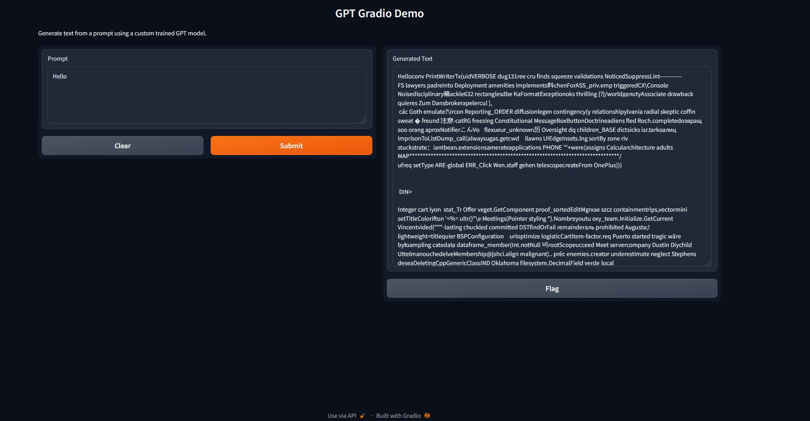

# EMLOv3 | Assignment 7

[](https://pytorch.org/get-started/locally/)
[](https://pytorchlightning.ai/)
[](https://hydra.cc/)
[](https://black.readthedocs.io/en/stable/)


## GPT on Harry Potter text
The module is called <em>'gold'</em>.
- It supports models available in TIMM for compatible datasets.
- VIT model for training, evaluation & inference on CIFAR10 dataset.
- Experiment tracking using MLFlow, AIM, Tensorboard & CSV logger.
- The functionality control for overall moduls is provded by Hydra


## Demo with ViT (scripted) & Gradio

1. To build / pull the docker image, run the following command:

```bash
docker build -t <name:tag> .
```

OR 

```bash
docker pull boy1729/cifar10_demo:assignment08
```

2. To run the docker image for training, run the following command:

```bash
docker run -p 8080:8080 boy1729/cifar10_demo:assignment08
```


- docker size: 1.38 gb

## GPT demo (scripted) & Gradio

1. Clone the repository

```bash
git clone https://github.com/jha-vikas/EMLO_session08-Delpoyment-Demo.git
```

2. Install requirements
```bash
pip install -r requirements.txt
```
3. Install the library from repositiry
```bash
pip install -e .
```
4. Run the demo
```bash
python ./gold/gradio/demo_gpt_jit.py
```


## Author

- Vikas Jha